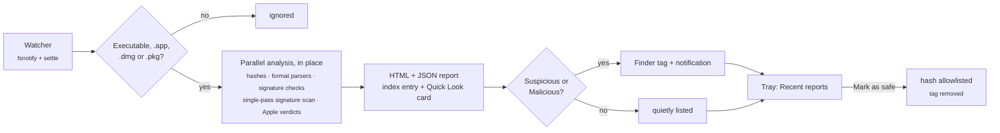

<p align="center">
  
</p>

<h1 align="center">binchk</h1>

<p align="center">
  <b>Every new program in your Downloads folder, checked in under a second.</b><br>
  A tray app for macOS, Windows and Linux that statically analyses new executables, apps, disk images and installers<br>
  where they land, writes a report, and flags the suspicious ones before you run them.
</p>

<p align="center">
  <a href="https://github.com/danczar/binchk/releases/latest"></a>
  
  
  <a href="LICENSE"></a>
</p>

<p align="center">
  <picture>
    <source media="(prefers-color-scheme: dark)" srcset="docs/images/report-dark.png">
    
  </picture>
</p>

---

## Why

Most malware still reaches a machine the boring way: a download. Antivirus
products look at it on their own terms and schedule. **binchk looks at
everything that lands in the folders you choose, the moment it lands.** It
pulls each new file apart statically, right where it is, and gives you a
verdict with evidence, usually in a few milliseconds. Suspicious and malicious
files get a notification (and on macOS a Finder tag); every file gets a report you can
open from the tray menu or, on macOS, glance at in Finder's preview pane.

binchk never executes, moves or deletes what it inspects. What you do with a
flagged download is up to you.

## Features

- ⚡ **Fast by design.** A typical download is analysed in 5–25 ms, a 400 MB Electron framework in about 0.7 s. A hard deadline guarantees a report within 15 s no matter what.
- 🏷️ **Flags without getting in the way.** Files stay where they are. Suspicious and malicious ones get a coloured Finder tag (`binchk: Suspicious` / `binchk: Malicious`) and a notification; clean ones are reported quietly.
- 👀 **Quick Look card.** macOS: select a file in Finder to see its binchk card in the preview pane or with Space.
- 🧬 **Understands executables**: ELF, Mach-O (thin and universal) and PE (EXE, DLL, drivers, .NET). Sections, segments, entry points, imports and exports, entropy, packers and embedded toolchains (Go module lists, Rust, PyInstaller, Electron and more).
- 🍎 **Understands macOS software.** `.app` bundles, `.dmg` disk images and `.pkg` installers are opened read-only and everything inside is analysed. Apple's own verdicts are included: code-signature seal, Gatekeeper, notarization and revoked certificates.
- 🔏 **Checks signatures**: Authenticode and Apple code signatures are parsed on every OS and verified natively (`WinVerifyTrust`, `codesign`/`spctl`).
- 🕵️ **357 content signatures in 36 rules** (ASCII and UTF‑16) for ransomware, cryptominers, infostealers (browsers, wallets, keychain, fake password prompts), offensive tooling, persistence, Gatekeeper/Defender tampering, reverse shells, exfiltration channels and more. All of them are matched in a **single pass**.
- 🌐 **Extracts indicators**: URLs, raw-IP URLs, public IPs, `.onion` addresses, and checksum-verified Bitcoin and Monero addresses.
- 🧾 **Readable reports**: a self-contained HTML report (light and dark) plus JSON, a compact card for Quick Look, a native notification, and a tray tooltip.
- 🧠 **Learns from you.** *Mark as safe* allowlists a file's hash and removes its tag. You can add your own rules and hash blocklists.

## How it works



For disk images, installers and apps, binchk lists every contained file with its own verdict:

<p align="center">
  <picture>
    <source media="(prefers-color-scheme: dark)" srcset="docs/images/dmg-dark.png">
    
  </picture>
</p>

## Install

### Download

Grab the build for your platform from the [latest release](https://github.com/danczar/binchk/releases/latest):

| Platform | Asset |
|---|---|
| macOS (Apple Silicon + Intel) | `binchk-<version>-macos.zip`: `binchk.app`, a menu-bar-only app |
| Linux x86-64 / arm64 | `binchk-<version>-linux-<arch>.tar.gz`: binary, icon and `.desktop` entry |
| Windows x64 / arm64 | `binchk-<version>-windows-<arch>.zip`: `binchk.exe` |

> [!IMPORTANT]
> The macOS build isn't notarized yet, so Gatekeeper will refuse to open it.
> binchk itself would warn you about any app that asked you to bypass
> Gatekeeper, so don't. [Build from source](#build-from-source) instead, which
> takes about a minute.

On Linux, the tray needs a StatusNotifierItem host. KDE and most desktops have
one; GNOME needs the *AppIndicator* extension.

### With Go

```bash
go install github.com/danczar/binchk/cmd/binchk@latest
```

Linux and Windows builds need no cgo. The macOS menu bar uses cgo, so Xcode's
command-line tools must be installed.

### Build from source

```bash
git clone https://github.com/danczar/binchk.git
cd binchk
make build        # bin/binchk for this machine
make app          # macOS: dist/binchk.app (universal, menu-bar only)
make all          # cross-build darwin / linux / windows × amd64 / arm64
make release      # macOS: release archives + SHA256SUMS in dist/release
```

## Usage

```bash
binchk                      # run in the tray / menu bar (the normal way)
binchk watch                # headless: watch folders and log to stdout
binchk scan FILE|APP|DIR…   # one-off analysis; results are indexed and tagged too
binchk scan -open -json ~/Downloads/some-tool.dmg
binchk scan -no-index FILE  # report only: no index entry, no Finder tag
```

The tray menu shows the latest verdict (click it to open the report) and
**Recent reports**: the 15 newest files binchk analysed, marked 🔴 / 🟠 / 🟢,
each with **Open report · Reveal in Finder · Mark as safe**. *Clear recent
reports* tidies the list without deleting any report. The icon turns orange or
red while a suspicious or malicious file is in the list and not marked safe.
There are also toggles for *Pause watching* and *Start at login*. `scan` exits
with 0 for clean, 1 on error, 2 for suspicious and 3 for malicious, so it's
easy to script.

### Finder tags and Quick Look (macOS)

After each analysis binchk sets a regular Finder tag on files whose verdict is
listed in `tag_verdicts` (by default `binchk: Suspicious` in orange and
`binchk: Malicious` in red), so flagged downloads stand out in Finder and in
searches. Your own tags are kept; binchk only ever adds, replaces or removes
its own `binchk: …` tag, and never follows symbolic links. A file that is
re-analysed as clean, or that you mark as safe, loses the tag.

Select a file in Finder to see its binchk card in the preview pane or with
Space: verdict, risk score, signer and notarization, and the top findings.
Files binchk hasn't looked at show "Not checked by binchk".

### Upgrading from v0.1

binchk v0.1 moved new files into a private vault before analysing them. It no
longer moves anything. On its first start, this version returns everything
still in the vault to the folder it came from (as `name (restored 1).ext` if that name is taken; nothing is
overwritten), analyses each file again in place, and tells you how many files
it put back. Restored files are not allowlisted.

## Verdicts

Each finding carries a weight (low 4 · medium 12 · high 30 · critical 60), and
the weights add up to a 0–100 risk score:

| Score | Verdict |
|---|---|
| 0–14 | 🟢 **Clean** |
| 15–44 | 🟠 **Suspicious** |
| 45+ or any critical finding | 🔴 **Malicious** |

Software with an OS-verified signature from an identified developer earns trust
(−20, plus −10 more if Apple notarized it) and isn't labelled Malicious on
heuristics alone. Revoked certificates earn nothing. Containers (apps, disk
images, installers) score *their own findings plus their single worst file*,
so a big legitimate app isn't penalised for shipping 60 frameworks.

Tested against a real `/Applications` folder (227 executables) and 25 real
downloaded installers, binchk rated every notarized app and installer Clean. It
also caught installers whose signing certificate Apple had revoked.

## Configuration

binchk creates its config on first run:

| OS | Config | Data (reports, index, log) |
|---|---|---|
| macOS | `~/Library/Application Support/binchk/config.json` | same folder |
| Linux | `~/.config/binchk/config.json` | `~/.local/share/binchk` |
| Windows | `%AppData%\binchk\config.json` | `%LOCALAPPDATA%\binchk` |

```jsonc
{
  "watch_dirs": [{ "path": "~/Downloads", "recursive": false }],
  "analysis_budget": "10s",        // hard deadline per analysis
  "settle_delay": "400ms",         // wait for downloads to finish writing
  "concurrent_scans": 2,
  "notifications": true,
  "notify_verdicts": ["Suspicious", "Malicious"],   // which verdicts notify
  "finder_tags": true,             // macOS: tag analysed files in Finder
  "tag_verdicts": ["Suspicious", "Malicious"],      // which verdicts get a tag
  "verify_signatures": true,       // codesign / WinVerifyTrust
  "inspect_installers": true,      // macOS: .app, .dmg, .pkg
  "rules_file": "rules.json",      // your own content rules
  "blocklist_file": "blocklist.txt",
  "allowlist_file": "allowlist.txt"
}
```

### Custom rules

Put your own rules in `rules.json`, next to the config. They're compiled into
the same single-pass matcher as the built-ins:

```json
[
  {
    "id": "acme-c2",
    "title": "Talks to ACME threat-actor infrastructure",
    "category": "command-and-control",
    "severity": "high",
    "strings": ["evil-acme.example", "/gate.php?bot="],
    "hex": ["de ad be ef 13 37"],
    "min": 1
  }
]
```

Text patterns match case-insensitively in ASCII/UTF‑8 and UTF‑16LE. `min` sets
how many distinct patterns must appear, and `escalate_at` / `escalate_to` raise
the severity when more of them do. The built-in rules live in
[`internal/analyze/rules/builtin.json`](internal/analyze/rules/builtin.json).

Hash lists are plain text files with one `sha256 [note]` per line. A
blocklisted hash is critical; an allowlisted one (which *Mark as safe* adds) is
always Clean.

### The report index

Every analysis, from the watcher or `binchk scan`, is also recorded in a small
content-addressed index in the data folder, which is what the Quick Look card
reads:

```
index/<sha256>.json       condensed result: verdict, score, signer, top findings, report path
index/<sha256>.html       the compact, self-contained card (no scripts, no external resources)
index/paths/<p>.json      p = SHA-256 of the file's absolute path → {sha256, size, mtime_unix_ns}
```

`<sha256>` is the file's SHA-256 (for an `.app`, its main executable's). The
path pointer lets a reader find a file's entry without hashing it, as long as
the file's size and modification time still match; otherwise it hashes the
file. Files are written atomically and named only by hex digests. Identical
content downloaded twice shares one entry. Use `binchk scan -no-index` to keep
a one-off scan out of the index.

## Under the hood

- **One mmap, zero copies.** Each file is mapped once, and every analyser reads the same pages.
- **Everything runs concurrently.** Hashing, the content scan, format parsing, toolchain detection and OS verification all run in parallel against one deadline. If the deadline hits, you get a partial report instead of a late one.
- **One pass for all signatures.** Every rule, in both encodings, compiles into a single Aho–Corasick DFA over byte equivalence classes. Scanning spreads across all cores at about **2.8 GB/s**.
- **Hostile input is expected.** Parser panics become findings, and code that overruns the deadline can't touch the finished report. Unmapping and unmounting wait until nothing is reading any more. Package extraction is pure Go and confined: no path traversal, no escaping symlinks, no setuid bits, byte caps against bombs.
- **binchk doesn't flag itself.** Its signature strings are embedded gzip-compressed, so the plaintext never appears in its own binary.

## Project layout

```
cmd/binchk            CLI entry point: tray | watch | scan
internal/ac           Aho–Corasick DFA matcher
internal/analyze      engine, content scan, ELF/Mach-O/PE analysers, rules, scoring
internal/container    .app / .dmg / .pkg inspection
internal/xar          pure-Go xar, cpio and pbzx readers with safe extraction
internal/watcher      fsnotify, settling, magic-byte and bundle detection
internal/app          pipeline, recent reports, mark as safe, events
internal/index        content-addressed report index read by the Quick Look card
internal/findertag    Finder tags via _kMDItemUserTags (macOS)
internal/bplist       minimal binary property list reader and writer
internal/legacy       one-time return of files held in the v0.1 vault
internal/tray         menu-bar / tray UI
internal/report       self-contained HTML report and Quick Look card
internal/notify       native notifications (toast, notify-send, macOS)
internal/provenance   download origin (kMDItemWhereFroms, xdg.origin.url, Zone.Identifier)
tools/mkicon          renders the app icon
docs/design           design notes for planned work
```

## Development

```bash
make test     # go test -race ./...
make bench    # matcher and engine benchmarks
make rules    # re-embed internal/analyze/rules/builtin.json after editing it
make icons    # re-render the icon and the Windows resources
```

The test suite builds inert "malware-looking" samples for all three OSes, plus
real disk images and installer packages, and runs the full watch → analyse →
report → index → tag pipeline end to end.

## Limitations

- **Static analysis only.** Nothing is executed or emulated, and there are no cloud reputation lookups. It's heuristics plus your own hash lists, so treat verdicts as triage, not certainty.
- **Archives** (`.zip`, `.tar.gz`, …) aren't unpacked yet; see the [design note](docs/design/archive-support.md). Until then, binchk acts when the extracted executable or app lands in a watched folder.
- **Disk images are mounted with `hdiutil`** (read-only, hidden, never auto-opened). A pure-Go reader that avoids mounting is planned. Images that demand a licence agreement aren't opened, because binchk won't accept the licence on your behalf.
- **Very large apps** (tens of thousands of files) inside compressed disk images are limited by macOS's decompression speed and may hit the time budget. The report says so when that happens.
- **Linux** has no native signature verification. Signers are parsed and reported, but not verified.
- Tray, notifications and signature verification have been exercised on macOS. Linux and Windows builds are cross-compiled and tested, but have had less real-desktop use. Bug reports are welcome.

## Roadmap

- [ ] Archive support: zip, tar.*, 7z, rar ([design](docs/design/archive-support.md))
- [ ] Pure-Go DMG (UDIF + APFS/HFS+) reader to replace mounting
- [ ] Notarized macOS release and signed Windows release
- [ ] Optional hash reputation lookups (opt-in)

## License

binchk is licensed under the [Apache License 2.0](LICENSE).
